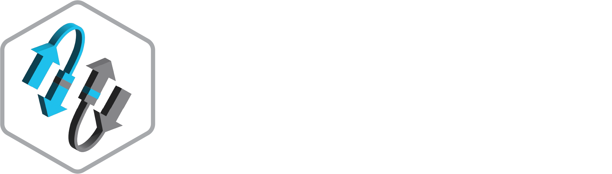

# sVEP Infrastructure

<div align="center">
    
</div>

## Prerequisites

The following dependencies are required in order to build the frontend and backend

- Terraform
    - `Terraform v1.9.4` or newer is required, and can be installed with the following commands
        ```
        # only for linux - find other OS versions here https://releases.hashicorp.com/terraform/1.9.4/
        cd ~
        wget https://releases.hashicorp.com/terraform/1.9.4/terraform_1.9.4_linux_amd64.zip
        sudo unzip terraform_1.9.4_linux_amd64.zip -d /usr/bin/
        ```

- [Docker](https://www.docker.com/products/docker-desktop/)
    - A running instance of Docker is required in order to build the pluginConsequence module as this Lambda function uses a custom Docker runtime

- Node.js
    - This project was generated with [Angular CLI](https://github.com/angular/angular-cli) version 17.0.1, which requires `Node.js v18.13` and `npm` (included with Node.js installation)
        ```
        # only for linux - find other OS versions here
        https://nodejs.org/en/download/package-manager
        # installs nvm (Node Version Manager)
        curl -o- https://raw.githubusercontent.com/nvm-sh/nvm/v0.40.0/install.sh | bash
        # download and install Node.js (you may need to restart the terminal)
        nvm install 23
        ```

- pnpm
    - While npm is supported pnpm has greater performance, and can be installed with the following commands
        ```
        # only for linux - find other OS versions here
        https://pnpm.io/installation
        # install via npm (comes with Node.js)
        npm install -g pnpm
        ```

## Deployment

Once all prerequisite software is installed, ensure a `backend.tf` file is created in the root directory that references the correct s3 bucket, region, and dynamodb table. A template has been provided [here](./backend.tf.example)

Set the AWS access keys and token as required.

```
export AWS_ACCESS_KEY_ID="AWS_ACCESS_KEY_ID"
export AWS_SECRET_ACCESS_KEY="AWS_SECRET_ACCESS_KEY"
export AWS_SESSION_TOKEN="AWS_SESSION_TOKEN"
```

From the root directory, install using `terraform init` to pull the required modules, followed by `terraform apply`, which will create the infrastucture.

```
terraform init
terraform plan # should finish without errors
terraform apply
```