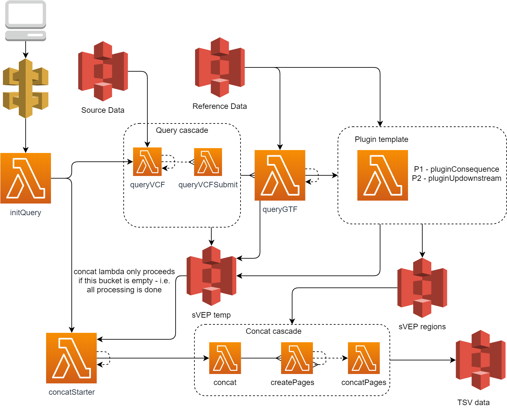

# Serverless VEP Architecture

Serverless VEP is a cloud native implementation of [Variant Effect Predictor](https://grch37.ensembl.org/info/docs/tools/vep/index.html) that parallelizes the annotation task, enabling a faster and more cost effective solution.

The framework has an orchestration engine that allows the selective execution of provided and external annotations plugins, making workflows highly customisable.

sVEP enhances annotation performance by recursively partitioning source files, ensuring that only the required data is sent to plugins.  Plugin outputs are concatenated once processing is complete.

